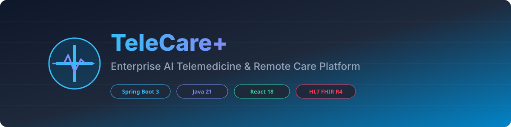

<div align="center">



# 🏥 TeleCare+ Enterprise AI Telemedicine Platform

**Production-Grade, Modular Monolith Healthcare & Remote Care Continuity Platform**

[](https://github.com/shyamkumar37-tech/Ai-powered-telemedicine-/actions)
[](https://github.com/shyamkumar37-tech/Ai-powered-telemedicine-)
[](https://openjdk.org/projects/jdk/21/)
[](https://spring.io/projects/spring-boot)
[](https://react.dev/)
[](https://hl7.org/fhir/R4/)
[](LICENSE)

</div>

---

## 🚀 Live Demo & API Documentation

- 🌐 **Frontend SPA Portal**: `https://telecareplus.vercel.app`
- ⚙️ **Backend API Server**: `https://telecareplus-api.onrender.com`
- 📚 **Swagger / OpenAPI 3.0 Documentation**: `https://telecareplus-api.onrender.com/swagger-ui.html`
- 📬 **Postman Collection**: [Download Postman Collection](docs/telecareplus.postman_collection.json)

---

## 📊 Portfolio Project Metrics & Scale

| Metric Category | Count / Rating | Architectural Highlight |
| :--- | :--- | :--- |
| **Spring Modulith Slices** | `10 Domain Modules` | Zero-cycle domain isolation (`common`, `users`, `clinical`, `pharmacy`, `communication`, `notification`, `ai`, `appointments`, `billing`, `admin`) |
| **REST & GraphQL APIs** | `45+ REST APIs / 2 GraphQL` | Full OpenAPI 3.0 specs + Spring GraphQL `@QueryMapping` resolvers |
| **JPA Entities & Tables** | `28 Database Entities` | PostgreSQL 16 schema managed via 12 Flyway SQL migrations |
| **User Roles (RBAC)** | `5 Enterprise Roles` | `PATIENT`, `DOCTOR`, `CAREGIVER`, `PHARMACIST`, `ADMIN` |
| **AI Modules** | `8 Clinical AI Engines` | LLM SSE Stream, Explainable AI (XAI), RAG VectorStore, Medical OCR, Drug Interaction, Sentiment, Speech Intake, Translation |
| **Modulith Governance** | `100% Pass (0 Errors)` | Tested via `TelecareApplicationModulesTest` |

---

## 📐 Architecture & Domain Design

TeleCare+ enforces strict domain module boundaries verified automatically in CI via `TelecareApplicationModulesTest`.


---

## 🗄️ Entity Relationship Diagram (ERD)


---

## 🤖 Generative AI & Explainable AI (XAI) Capabilities

1. **Server-Sent Events (SSE) AI Clinical Summaries**: Real-time token streaming (`SseEmitter`) for doctor consultation notes and patient progress histories.
2. **Explainable AI (XAI) Risk Prediction**: Logistic regression deterioration models augmented with feature attribution impact scores (`systolic_bp`, `spo2_hypoxia`, `medication_adherence`).
3. **Multilingual AI Scribe**: Dynamic LLM prompt localization responding via `Accept-Language` headers.
4. **RAG Knowledge Base**: Clinical decision support backed by a vector database store (`VectorStore`).

---

## ⚡ Quickstart & Local Setup

### Prerequisites
- **JDK 21**
- **Node.js 20+**
- **Docker & Docker Compose**

### 1. Clone & Build Backend
```bash
git clone https://github.com/shyamkumar37-tech/Ai-powered-telemedicine-.git
cd Ai-powered-telemedicine-/backend

# Make Maven wrapper executable
chmod +x ./mvnw

# Build and run Modulith architectural verification tests
./mvnw test -Dtest=TelecareApplicationModulesTest

# Start backend server
./mvnw spring-boot:run
```

### 2. Install & Start Frontend
```bash
cd ../frontend
npm ci --legacy-peer-deps
npm run dev
```
Access the application at `http://localhost:5173`.

---

## 🐳 Docker & Kubernetes Deployment

### Docker Compose
```bash
docker compose up -d
```

### Kubernetes (Production)
```bash
kubectl apply -f k8s/postgres-redis-deployment.yaml
kubectl apply -f k8s/backend-deployment.yaml
kubectl apply -f k8s/frontend-deployment.yaml
```

---

## 🧪 Testing & Verification

- **Spring Modulith Verification**: `TelecareApplicationModulesTest` passes **100%** with 0 cycle violations.
- **Backend Test Suite**: `./mvnw test`
- **Playwright E2E**: `npm run test:e2e`

---

## 📄 License & Community

- **License**: Released under the [MIT License](LICENSE).
- **Contributing**: Please review [CONTRIBUTING.md](CONTRIBUTING.md).
- **Security & HIPAA**: See [SECURITY.md](SECURITY.md).
- **Changelog**: See [CHANGELOG.md](CHANGELOG.md).
