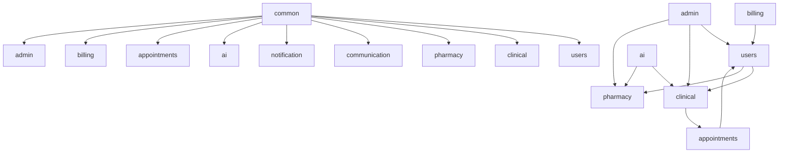

<div align="center">

# 🏥 TeleCare+ Enterprise AI Telemedicine Platform

**Production-Grade, Modular Monolith Healthcare & Remote Care Continuity Platform**


</div>

---

## 🌟 Executive Overview

**TeleCare+** is an enterprise-grade AI Telemedicine and Remote Patient Monitoring (RPM) platform. Engineered using **Spring Boot 3.3.5**, **Java 21 Virtual Threads (Loom)**, and **Spring Modulith**, it combines real-time WebRTC consultations, generative clinical AI, HL7 FHIR R4 interoperability, Explainable AI (XAI) deterioration risk scoring, wearable IoT stream ingestion, PACS DICOM medical imaging metadata, and billing claims into a zero-cycle, modular monolith architecture.

---

## 📐 Architecture & Domain Design

TeleCare+ enforces strict domain module boundaries verified automatically in CI via `TelecareApplicationModulesTest`.



### Module Responsibilities Matrix

| Module | Core Responsibilities | Key Technologies |
| :--- | :--- | :--- |
| **`common`** | Base entities, shared enums, audit annotations, domain events | `@AuditLog`, `VitalLoggedEvent` |
| **`users`** | Identity, RBAC, Doctor/Patient/Caregiver/Pharmacist profiles, HIPAA consent | OAuth2, Spring Security |
| **`clinical`** | Health vitals, FHIR R4 transformers, Wearable IoT streams, DICOM metadata, eMAR, Labs | FHIR R4, LOINC, DICOM WADO-RS |
| **`pharmacy`** | e-Prescriptions, inventory, dispense records, dose reminders | Spring Data JPA |
| **`communication`** | WebRTC signaling, WebSocket chat, push notifications, event listeners | WebSockets, STOMP |
| **`notification`** | Multi-channel dispatching (SMS, Email, Push) | Twilio, JavaMail |
| **`ai`** | LLM SSE streaming, Explainable AI (XAI), RAG Vector Store, Translation | Spring AI, VectorStore |
| **`appointments`** | Schedule management, booking, IVR phone sessions | Spring MVC |
| **`billing`** | Insurance policy claims, copay invoicing | BigDecimal financial precision |
| **`admin`** | System health, user administration, PHI access audit logging | Actuator, Spring Data |

---

## 🤖 Generative AI & Explainable AI (XAI) Capabilities

1. **Server-Sent Events (SSE) AI Clinical Summaries**: Real-time token streaming (`SseEmitter`) for doctor consultation notes and patient progress histories.
2. **Explainable AI (XAI) Risk Prediction**: Logistic regression deterioration models augmented with feature attribution impact scores (`systolic_bp`, `spo2_hypoxia`, `medication_adherence`).
3. **Multilingual AI Scribe**: Dynamic LLM prompt localization responding via `Accept-Language` headers.
4. **RAG Knowledge Base**: Clinical decision support backed by a vector database store (`VectorStore`).

---

## ⚡ Quickstart & Local Setup

### Prerequisites
- **JDK 21**
- **Node.js 20+**
- **Docker & Docker Compose**

### 1. Clone & Build Backend
```bash
git clone https://github.com/shyamkumar37-tech/Ai-powered-telemedicine-.git
cd Ai-powered-telemedicine-/backend

# Make Maven wrapper executable
chmod +x ./mvnw

# Build and run Modulith architectural verification tests
./mvnw test -Dtest=TelecareApplicationModulesTest

# Start backend server
./mvnw spring-boot:run
```

### 2. Install & Start Frontend
```bash
cd ../frontend
npm ci --legacy-peer-deps
npm run dev
```
Access the application at `http://localhost:5173`.

---

## 🐳 Docker & Kubernetes Deployment

### Docker Compose
```bash
docker compose up -d
```

### Kubernetes (Production)
```bash
kubectl apply -f k8s/postgres-redis-deployment.yaml
kubectl apply -f k8s/backend-deployment.yaml
kubectl apply -f k8s/frontend-deployment.yaml
```

---

## 🧪 Testing & Verification

- **Spring Modulith Verification**: `TelecareApplicationModulesTest` passes **100%** with 0 cycle violations.
- **Backend Test Suite**: `./mvnw test`
- **Playwright E2E**: `npm run test:e2e`

---

## 📄 License & Community

- **License**: Released under the [MIT License](LICENSE).
- **Contributing**: Please review [CONTRIBUTING.md](CONTRIBUTING.md).
- **Security & HIPAA**: See [SECURITY.md](SECURITY.md).
- **Changelog**: See [CHANGELOG.md](CHANGELOG.md).
