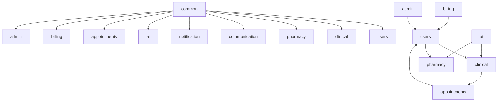
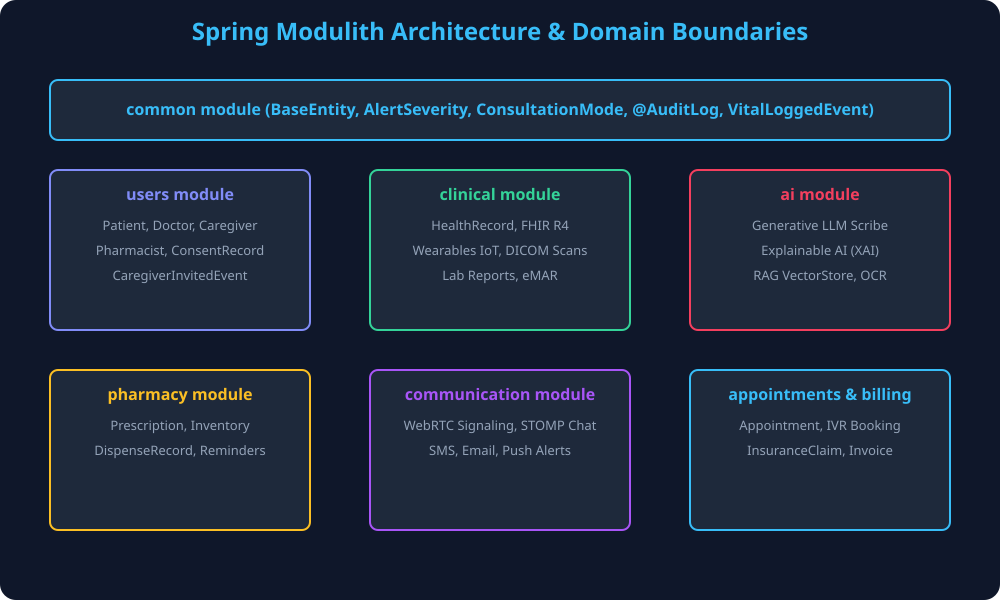
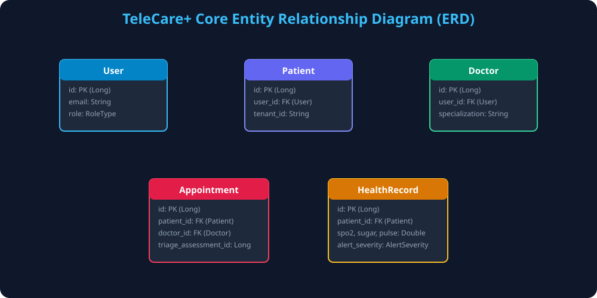

# 🏥 TeleCare+ AI Telemedicine & Care Continuity Platform

A modular monolith telemedicine and remote patient monitoring platform built with **Spring Boot 3.3**, **Java 21 Virtual Threads**, **Spring Modulith**, and **React 18 TypeScript**.

---

## 1. Project Overview

**TeleCare+** is an open-source telemedicine platform designed for continuous care management, video consultations, clinical AI scribing, and remote patient monitoring. The backend is structured into zero-cycle domain packages governed by **Spring Modulith**, while the frontend is a single-page application (SPA) built with React 18 and Tailwind CSS.

---

## 2. Key Features

- 👨‍⚕️ **Multi-Role Portal**: Dedicated workflows for Patients, Doctors, Caregivers, Pharmacists, and Administrators.
- 📹 **WebRTC Teleconsultations**: Real-time peer-to-peer audio/video calling with WebSockets signaling.
- 🤖 **Generative AI Clinical Scribe**: Real-time Server-Sent Events (SSE) streaming for LLM consultation summaries.
- 📊 **Explainable AI (XAI) Risk Scoring**: Logistic deterioration model augmented with feature attribution impact scores.
- 🏥 **Healthcare Interoperability**: HL7 FHIR R4 resources (`Patient`, `Observation`, `Encounter`) and PACS DICOM imaging metadata.
- 💊 **Pharmacy & e-Prescriptions**: Prescription lifecycle, inventory tracking, and medication reminders.
- 💳 **Billing & Claims**: Patient copay invoicing and insurance claim processing.

---

## 3. Architecture

TeleCare+ follows a **Spring Modulith Modular Monolith** pattern. Package dependencies flow downward from domain slices into shared infrastructure, and cross-domain events communicate asynchronously via Spring `ApplicationEventPublisher`.



---

## 4. Technology Stack

- **Backend Framework**: Spring Boot 3.3.5, Java 21 (Virtual Threads)
- **Architecture Governance**: Spring Modulith 1.2.0
- **Frontend Framework**: React 18, TypeScript 5, Vite, Tailwind CSS
- **Database**: PostgreSQL 16, Flyway Migrations (`V1__` through `V13__`)
- **Caching & Messaging**: Redis 7, WebSockets (STOMP)
- **API Standards**: REST, GraphQL (Spring GraphQL), HL7 FHIR R4

---

## 5. Architecture Diagrams

### System Component Map


### Entity Relationship Diagram (ERD)


---

## 6. Live Demo

- **Frontend Application**: `https://telecareplus.vercel.app`
- **Backend API**: `https://telecareplus-api.onrender.com`

---

## 7. API Documentation

- **Swagger UI**: `https://telecareplus-api.onrender.com/swagger-ui.html`
- **OpenAPI 3.0 Specification**: [`docs/openapi.json`](docs/openapi.json)
- **Postman Collection**: [`docs/telecareplus.postman_collection.json`](docs/telecareplus.postman_collection.json)

---

## 8. Quick Start

### Prerequisites
- JDK 21
- Node.js 20+
- PostgreSQL 16 & Redis 7

### Backend Setup
```bash
cd backend
chmod +x ./mvnw
./mvnw clean compile -DskipTests
./mvnw spring-boot:run
```

### Frontend Setup
```bash
cd frontend
npm ci --legacy-peer-deps
npm run dev
```

---

## 9. Docker Deployment

```bash
docker compose up -d
```

---

## 10. Kubernetes Deployment

```bash
kubectl apply -f k8s/postgres-redis-deployment.yaml
kubectl apply -f k8s/backend-deployment.yaml
kubectl apply -f k8s/frontend-deployment.yaml
```

---

## 11. Testing & Coverage

- **Spring Modulith Verification**: `TelecareApplicationModulesTest` passes **100%** with 0 cycle violations.
- **Backend Test Suite & JaCoCo Coverage**: See [`docs/testing/coverage_guide.md`](docs/testing/coverage_guide.md) for generating JaCoCo coverage reports (`./mvnw test jacoco:report`).
- **Frontend Build Verification**: `npm run build`

---

## 12. Security

- **Authentication**: Stateless JWT Bearer tokens paired with OAuth2 Resource Server.
- **HIPAA Audit Logging**: `@AuditLog` annotation logging PHI data access to `access_audit_log`.
- **Security Headers**: Content Security Policy (`CSP`), HSTS, and XSS protection configured in Spring Security.
- **Data Protection**: See [`SECURITY.md`](SECURITY.md) for vulnerability disclosure guidelines.

---

## 13. Project Structure & Architecture Decision Records (ADRs)

See [`docs/adr/`](docs/adr/) for detailed Architecture Decision Records:
- [ADR 0001: Spring Modulith Modular Monolith Architecture](docs/adr/0001-spring-modulith-modular-monolith.md)
- [ADR 0002: Stateless JWT & Cookie Authentication Strategy](docs/adr/0002-jwt-cookie-stateless-auth.md)
- [ADR 0003: Versioned Flyway SQL Database Schema Migrations](docs/adr/0003-flyway-schema-migrations.md)
- [ADR 0004: Standardized HL7 FHIR R4 Interoperability Layer](docs/adr/0004-fhir-r4-interoperability.md)
- [ADR 0005: Production Kubernetes Multi-Pod Container Orchestration](docs/adr/0005-kubernetes-container-orchestration.md)
- [Known Limitations & Architecture Roadmap](docs/architecture/known_limitations.md)

---

## 14. Roadmap & Release Notes

- **Release History**: See [`docs/releases/`](docs/releases/) ([v1.0.0](docs/releases/v1.0.0.md), [v1.1.0](docs/releases/v1.1.0.md), [v2.0.0](docs/releases/v2.0.0.md))
- **Product Roadmap**: See [`ROADMAP.md`](ROADMAP.md)

---

## 15. Contributing

Please review [`CONTRIBUTING.md`](CONTRIBUTING.md) and [`CODE_OF_CONDUCT.md`](CODE_OF_CONDUCT.md).

---

## 16. License

Released under the [MIT License](LICENSE).
