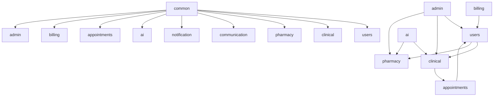
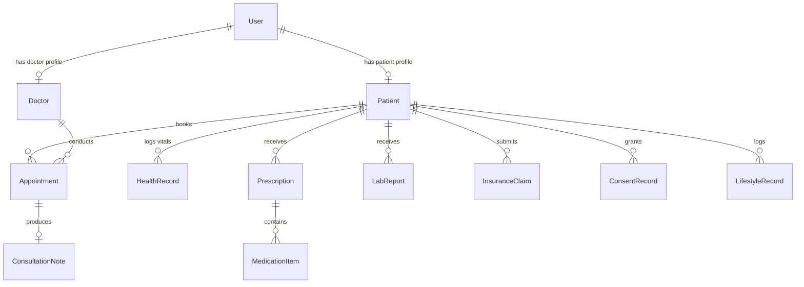

# TeleCare+ Enterprise Architecture & Technical Specification

## System Overview

**TeleCare+** is a production-grade, AI-powered Telemedicine and Chronic Care Continuity Platform designed as a **Spring Boot 3 Modular Monolith** on **Java 21 Virtual Threads**, paired with a **React 18 TypeScript Single Page Application (SPA)**.

---

## 1. Domain Component Architecture (Spring Modulith)

The backend application is structured into zero-cycle, modular domain slices validated via `TelecareApplicationModulesTest`:

### Domain Module Specifications
- **`common`**: Core base entities (`BaseEntity`), shared enums (`AlertSeverity`, `ConsultationMode`, `RoleType`), audit annotations (`@AuditLog`, `@Auditable`), and domain events (`VitalLoggedEvent`).
- **`users`**: User identity, roles (`PATIENT`, `DOCTOR`, `CAREGIVER`, `PHARMACIST`, `ADMIN`), profile management, caregiver links, and digital consent records (`ConsentRecord`).
- **`clinical`**: Medical records, health vitals, eMAR, triage assessments, HL7 FHIR R4 transformers (`FhirTransformer`), wearable IoT stream ingestion (`WearableIngestionController`), lab results (`LabReport`), and lifestyle logs (`LifestyleRecord`).
- **`pharmacy`**: e-Prescriptions (`Prescription`), medication catalog, pharmacy inventory, dose reminders, dispense tracking, and delivery workflow.
- **`communication`**: Real-time WebRTC signaling (`/queue/webrtc`), push notification REST controllers, Chat Messaging, and event listeners for `CaregiverInvitedEvent` & `AlertNotificationEvent`.
- **`notification`**: Multi-channel alert dispatching (SMS via Twilio, Email via JavaMail, and WebSocket alerts).
- **`ai`**: Spring AI generative models, explainable AI (XAI) feature attributions (`MlRiskModelService`), AI medical scribing, language translation (`TranslationService`), sentiment analytics, and RAG Knowledge Base (`VectorStore`).
- **`appointments`**: Patient-doctor appointment booking, doctor schedule management, and IVR telephone booking sessions.
- **`billing`**: Insurance policy claims (`InsuranceClaim`), copay invoicing (`Invoice`), and payment processing.
- **`admin`**: System status monitoring, user administration (`AdminUserController`), data seeder (`DataSeeder`), and access audit logging (`AccessAuditService`).

---

## 2. Entity Relationship Diagram (ERD)

---

## 3. Architecture Decision Records (ADRs)

### ADR 001: Modular Monolith vs. Microservices Architecture
- **Status**: Accepted
- **Context**: High operational overhead and network latency of microservices for a healthcare startup.
- **Decision**: Adopt Spring Modulith. Enforce package boundaries so domain slices depend strictly on public contracts.
- **Consequences**: Zero circular package dependencies, simplified single-artifact deployment, and seamless transition to microservices if needed in the future.

### ADR 002: Event-Driven Inter-Module Communication
- **Status**: Accepted
- **Context**: Direct service injection between domain modules (e.g., `users` calling `communication`) caused circular package dependencies.
- **Decision**: Use Spring `ApplicationEventPublisher` for asynchronous decoupled event handling (`CaregiverInvitedEvent`, `AlertNotificationEvent`, `VitalLoggedEvent`).

### ADR 003: Standardized Healthcare Interoperability (FHIR R4)
- **Status**: Accepted
- **Context**: Interoperability with hospital EHRs and external pharmacy systems requires standardized medical data exchange.
- **Decision**: Implement FHIR R4 transformers mapping domain entities to `FhirPatientResource`, `FhirObservationResource`, and `FhirEncounterResource` exposed at `/api/fhir/r4/*`.

---

## 4. Security & Compliance Specification
- **Authentication**: Stateless JWT Bearer tokens paired with OAuth2 Resource Server.
- **CSRF & XSS Protection**: Cookie-based CSRF protection (`XSRF-TOKEN`) with strict Content Security Policy (`CSP`) headers.
- **HIPAA Audit Trail**: `@AuditLog` aspect logging every access to Protected Health Information (PHI) to `access_audit_log`.
- **Multi-Tenancy**: Schema-based multi-tenant data isolation using Hibernate 6 `@TenantId`.
