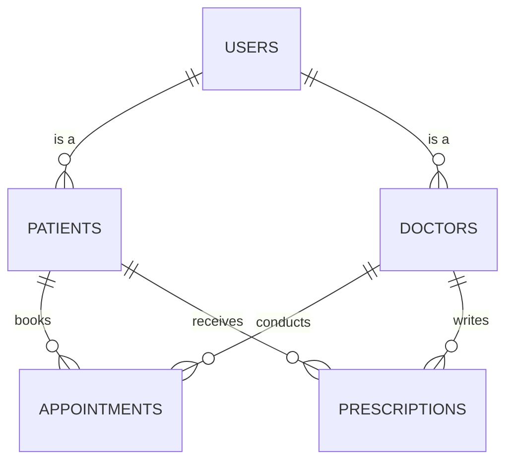
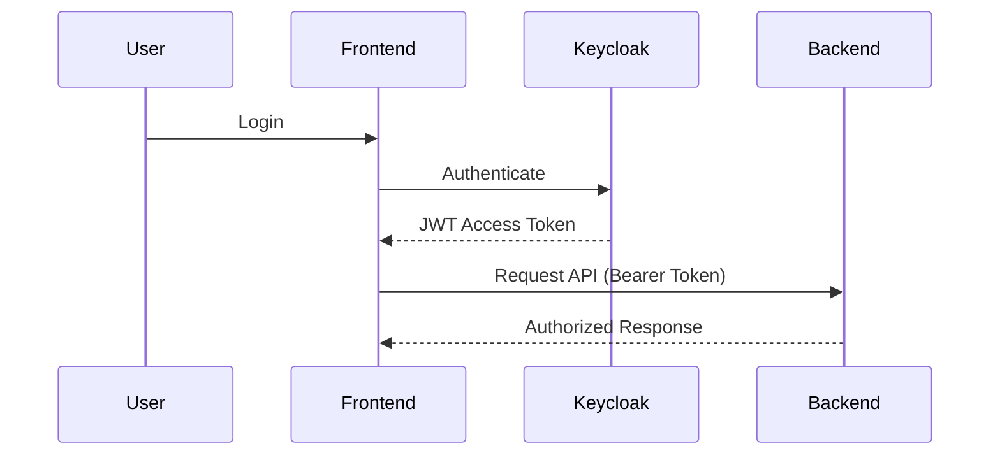

# Telecare+ System Architecture

## High-Level System Design
The platform utilizes a modern containerized microservices approach.
- **Frontend**: React (Vite), Tailwind CSS, Framer Motion
- **Backend**: Spring Boot 3, Spring Security, Spring AI, WebSockets (STOMP)
- **Database**: PostgreSQL (Relational Data), Redis (Caching)
- **Search**: Elasticsearch (Audit & Analytics)
- **Identity**: Keycloak (OAuth2 / OIDC)

## Entity Relationship (ER) Diagram

## Security Flow

