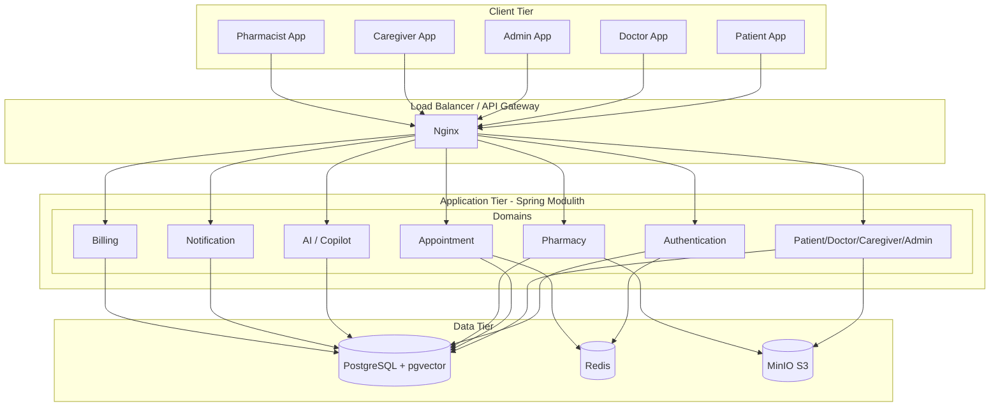

# TeleCare+ Architecture Optimization Report
**Principle:** Maximum User Value with Minimum Operational Complexity

> [!IMPORTANT]
> **Architecture Decision Principle:** Every technology and feature must solve a demonstrated business or clinical problem. Technologies that primarily increase deployment, operational, or maintenance complexity without providing proportional value to users are intentionally excluded. The platform favors simplicity, maintainability, and incremental scalability over unnecessary architectural sophistication.

## 1. Final Optimized Technology Stack
*The simplest architecture that satisfies today's requirements.*

| Layer | Technology | Category | Justification |
| :--- | :--- | :--- | :--- |
| **Frontend Framework** | React (Vite) | Essential | High developer productivity, excellent ecosystem. |
| **Frontend State** | Zustand | Essential | Extremely lightweight, boilerplate-free state management. Far simpler than Redux. |
| **Frontend Data Fetching** | React Query | Essential | Out-of-the-box caching, retry logic, and synchronization. |
| **Frontend Animations** | Framer Motion | Optional (Keep) | High user value: Provides modern, fluid UX. Kept subtle to ensure clarity in healthcare screens. |
| **Backend Framework** | Spring Boot 3.x | Essential | Robust, secure, and rapid enterprise development. |
| **Architecture** | Modular Monolith (Spring Modulith) | Essential | Organizes backend into strict modules (Patient, Doctor, Appointment, Pharmacy, AI, Notification, Authentication, Billing, Caregiver, Admin) without network complexity. |
| **Database Migration** | Flyway | Essential | Version-controls the database schema ensuring repeatable migrations across all environments. |
| **Database** | PostgreSQL | Essential | Rock-solid ACID compliance, relational integrity, and JSONB support. |
| **Vector Search (AI)** | pgvector (PostgreSQL extension) | Essential | Enables AI Retrieval-Augmented Generation (RAG) without requiring a separate vector database. |
| **Object Storage** | MinIO (or AWS S3) | Essential | Required for secure, scalable medical image and document storage. |
| **Caching/Rate Limiting** | Redis | Optional (Keep) | Necessary for session management, fast caching, and API rate limiting. |
| **API Documentation** | OpenAPI (Swagger) | Essential | Automatically generates API documentation for frontend developers, testers, and integrations. |
| **Testing** | Playwright & Testcontainers | Essential | Playwright for E2E testing. Testcontainers runs real PostgreSQL/Redis during automated backend tests to reflect production behavior. |
| **Deployment** | Docker Compose | Essential | Simple, reproducible deployments without orchestrator overhead. |
| **CI/CD** | GitHub Actions | Essential | Automates build, tests, linting, and Docker image creation for a repeatable CI pipeline. |

---

## 2. Technologies Removed

| Technology | Reason for Removal | Business / Operational Impact |
| :--- | :--- | :--- |
| **Kubernetes** | Unnecessary operational overhead for the current scale. | Saves significant DevOps time, reduces infrastructure cost, simplifies deployment. |
| **Service Mesh (Istio)** | Overkill for a monolith. | Removes complex network debugging, sidecar proxy overhead, and certificate management. |
| **Apache Spark** | Big data analytics is not a current requirement. | Reduces memory footprint and operational complexity. |
| **Multiple Databases (Polyglot)**| Operational nightmare to synchronize and backup. | Single source of truth (PostgreSQL) dramatically simplifies backups and compliance. |
| **Three.js** | Unnecessary for a 2D Telemedicine interface unless specifically rendering 3D anatomical models. | Reduces frontend bundle size and development complexity. |

---

## 3. Technologies Replaced

| Original Technology | Replaced With | Justification |
| :--- | :--- | :--- |
| **Microservices** | **Modular Monolith** | A modular monolith provides the code organization of microservices but runs as a single process, eliminating distributed network failures. |
| **Elasticsearch** | **PostgreSQL Full-Text Search** | PostgreSQL's built-in FTS is incredibly fast and powerful for text search, eliminating the need to sync data to a separate JVM-heavy search cluster. |
| **GraphQL** | **REST APIs** | REST is simpler to cache, monitor, and secure. Standard OpenAPI/Swagger provides excellent documentation without GraphQL's query complexity and N+1 risks. |
| **Event Sourcing** | **Simple CRUD + Audit Tables** | Event sourcing introduces immense complexity in reading state. Simple CRUD with triggers or AOP-based Audit Logging fulfills HIPAA tracking requirements easily. |

---

## 4. Core Workspaces
*The platform supports dedicated, specialized workspaces for the core stakeholders:*

1.  **Patient**: Self-service care, appointments, records, and AI assistance.
2.  **Doctor**: Clinical copilot, patient timelines, schedules, and SOAP notes.
3.  **Caregiver**: Family network management and dependent care tracking.
4.  **Pharmacist**: Prescription fulfillment and inventory management.
5.  **Admin (New)**: User management, role assignment, hospital settings, audit log viewing, analytics, inventory overview, AI usage metrics, system monitoring, and broadcast notifications.

---

## 5. Healthcare Features (Phased Rollout)
*Instead of building everything at once, we are prioritizing by immediate clinical and operational value.*

### Phase 1: High-Impact Clinical Tools
1.  **AI Health Timeline**: Synthesizes past visits, labs, and vitals into a chronological summary for doctors.
2.  **Medication Intelligence**: Interaction checker that automatically flags risky drug combinations.
3.  **AI Lab Report Summary**: Translates complex PDF lab reports into patient-friendly language.
4.  **Smart Follow-up Scheduler**: Automated prompts for doctors to schedule follow-ups based on diagnosis.
5.  **Appointment Queue**: Seamless calendar management with timezone support.
6.  **Emergency Detection**: One-tap emergency alert system for high-risk patients.

### Phase 2: Enhanced Telehealth & Operations
7.  **AI Documentation (SOAP Notes)**: Automated generation of clinical notes.
8.  **AI Clinical Copilot**: Suggests diagnoses or follow-up questions during a consultation.
9.  **Teleconsultation**: Integrated secure WebRTC video calls.
10. **Digital Consent**: E-signatures for HIPAA and treatment consent.
11. **Family Health Records**: Allows delegates to manage care for dependents.

### Phase 3: Extended Health Management
12. **Vaccination Tracker**: Digital immunization records.
13. **Referral Management**: Tracking patient movement between specialists.
14. **Medicine Ordering**: Direct integration with the Pharmacist workspace workflow.
15. **Billing**: Simplified patient invoicing and payment tracking.
16. **Insurance**: Insurance verification and claim management.

---

## 6. Updated Architecture Diagram

---

## 7. Deployment & Infrastructure
* **Paradigm**: Docker Compose. It avoids the steep learning curve and operational overhead of Kubernetes.
* **CI/CD**: GitHub Actions automates Build, Tests (Playwright/Testcontainers), Linting, and Docker image creation. 
* **Backups**: A single automated `pg_dump` cron job, plus MinIO bucket replication.

## 8. Security & AI Architecture
* **Security**: Stateless JWTs stored in secure, `HttpOnly` cookies. Spring Security Role-Based Access Control (RBAC). PostgreSQL Row-Level Security (RLS). Immutable Audit Logs.
* **AI Architecture**: Spring AI + PostgreSQL with `pgvector` for Retrieval-Augmented Generation (RAG). Medical documents (PDFs) are embedded upon upload and stored directly in Postgres alongside relational data.
